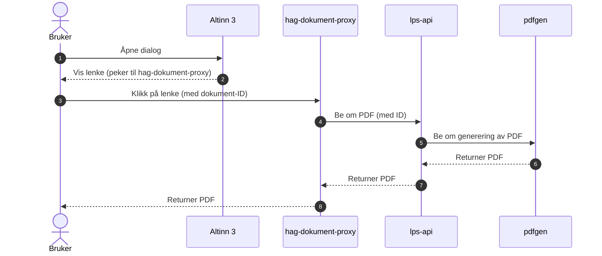
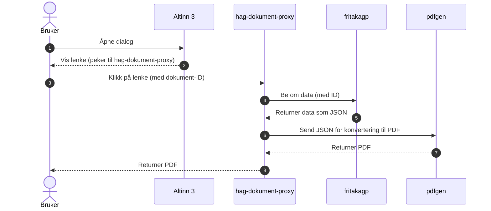

# Dokument Proxy

Dette er en app for visning av pdf dokumenter for arbeidsgivere.

bruker node og express

Dette repoet bruker Github Copilot til å generere kode

## Hvordan Proxy appen funker

Denne proxy appen er et mellomlag i våre systemer mellom altinn innboks brukere og våre interne systemer.
Proxy appen håndterer kompleksiteten av autentisering, bruker login og omdirigering til feilsider.  
For å gi en oversikt er det inkludert sekvens diagram for å vise hvordan systemene samhandler og i hvilken rekkefølge ting skjer.

## Sykepenger PDF fra LPS API

Brukeren åpner dialogen, klikker på lenken, og dokumentet hentes og returneres. Når lps-api blir bedt om PDF-en, gjør den i tillegg et kall til pdfgen for å generere PDF-en:

## FritakAGP PDF

Brukeren åpner dialogen og klikker på lenken. fritakagp returnerer kun en JSON-versjon av dataene, og proxyen gjør deretter et kall til pdfgen for å konvertere JSON til PDF:

